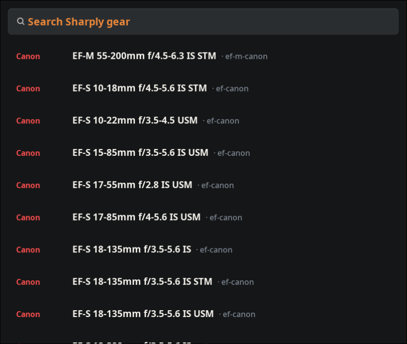
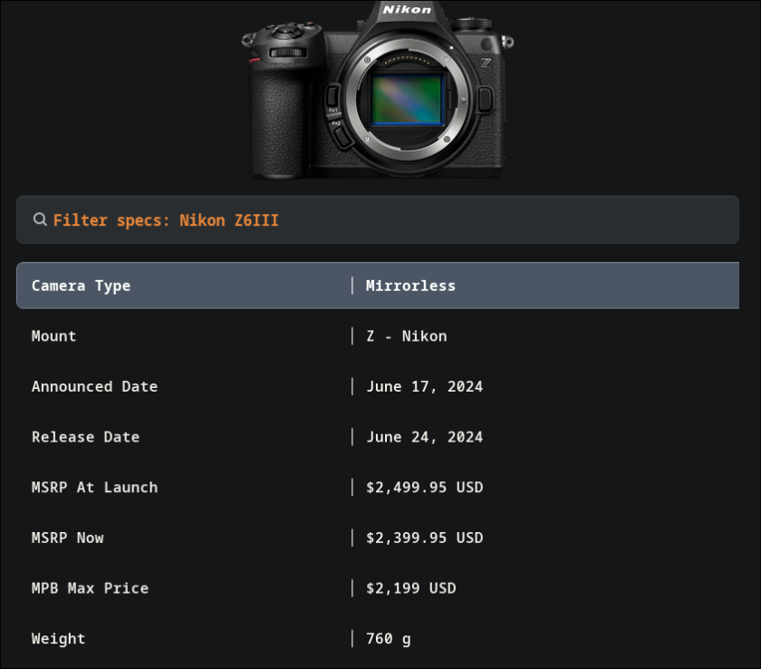

<a id="readme-top"></a>

<div align="center">

# Sharply Search

### Photography gear, one shortcut away.

A native Wayland launcher for finding real cameras and lenses on
[Sharply Photo](https://www.sharplyphoto.com/), inspecting their live specifications,
and copying the details you need without leaving the keyboard.

[](LICENSE)
[](https://wayland.freedesktop.org/)
[](https://hg.sr.ht/~scoopta/wofi)
[](https://www.sharplyphoto.com/developer/docs)

</div>

<details>
  <summary>Table of contents</summary>
  <ol>
    <li><a href="#about">About</a></li>
    <li><a href="#features">Features</a></li>
    <li><a href="#system-requirements">System requirements</a></li>
    <li><a href="#installation">Installation</a></li>
    <li><a href="#usage">Usage</a></li>
    <li><a href="#configuration">Configuration</a></li>
    <li><a href="#troubleshooting">Troubleshooting</a></li>
    <li><a href="#license">License</a></li>
    <li><a href="#acknowledgments">Acknowledgments</a></li>
  </ol>
</details>

## About

Sharply Search turns `Super+G` into a fast photography-gear reference. It talks
directly to Sharply's supported, read-only developer API and presents the results
in Wofi. Search results and specifications are never maintained locally, so names,
labels, prices, and technical data stay aligned with Sharply's live catalog.

This is an independent community launcher. It is not an official Sharply Photo
application and is not affiliated with Sharply Photo.

<p align="center">
  
  
</p>

<p align="right">(<a href="#readme-top">back to top</a>)</p>

## Features

- Instant fuzzy search over Sharply's cached 1,600+ item API catalog.
- Prebuilt colored search index for near-instant Wofi startup.
- Real specification values from `/api/v1/gear/{slug}/specs`.
- Cached Sharply thumbnails in the gear-detail view when available.
- Authoritative labels from Sharply's live `/api/v1/specs` registry.
- Aligned `Label │ Value` columns in a dedicated monospace detail view.
- Case-insensitive, order-independent partial matching for gear names and brands,
  plus fuzzy matching for individual specifications.
- Semantic lens aliases including `nifty fifty`, `human eye`, `tight`, `tele`,
  and `telephoto`.
- Searchable lens type, common mount aliases, and catalog years, including
  `prime`, `zoom`, `RF mount`, `Z mount`, `E mount`, and `MFT`.
- Compact lens aliases such as `pancake`, `slim`, and `low profile` when the
  catalog name identifies a pancake design.
- One-key copying of `Label: Value` to the Wayland clipboard.
- Optional desktop notification after copying.
- Direct link to the complete Sharply gear page.
- Helpful API, authentication, validation, and rate-limit errors inside Wofi.
- Native Hyprland installer and a ready-to-use `Super+G` binding.
- API credentials remain outside the repository and out of process arguments.

<p align="right">(<a href="#readme-top">back to top</a>)</p>

## System requirements

| Requirement | Purpose |
|---|---|
| Linux with a Wayland session | Runtime platform |
| [Wofi](https://hg.sr.ht/~scoopta/wofi) | Search and detail interface |
| Bash 5+ | Launcher runtime and startup timing |
| `curl` | Authenticated catalog and specification requests |
| `jq` | JSON processing and live label mapping |
| `wl-copy` from `wl-clipboard` | Copying selected specifications |
| `xdg-open` | Opening full gear pages |
| `notify-send` *(optional)* | Copy confirmation notifications |
| Hyprland *(optional)* | Automatic `Super+G` binding |
| Sharply developer API key | Access to the read-only `/api/v1` endpoints |
| Fontconfig (`fc-cache`) | Registering the bundled Space Grotesk font |

Example package installation on Arch Linux:

```bash
sudo pacman -S wofi curl jq wl-clipboard xdg-utils libnotify
```

<p align="right">(<a href="#readme-top">back to top</a>)</p>

## Installation

1. Open a terminal in your checkout:

   ```bash
   cd /path/to/SharplySearch
   ```

2. Run the installer:

   ```bash
   chmod +x sharply-search install.sh
   ./install.sh
   ```

3. Open the generated private configuration file:

   ```bash
   $EDITOR ~/.config/sharply-search/.env
   ```

4. Add a key created in the [Sharply developer portal](https://www.sharplyphoto.com/developer):

   ```dotenv
   SHARPLY_API_KEY=sharply_live_your_key_here
   ```

5. Press `Super+G`, or test it from a terminal:

   ```bash
   sharply-search
   ```

The installer creates these links and files:

```text
~/.local/bin/sharply-search
~/.config/sharply-search/.env
~/.config/wofi/sharply-search.css
~/.config/wofi/sharply-search-details.css
~/.config/hypr/sharply-search.conf
```

<p align="right">(<a href="#readme-top">back to top</a>)</p>

## Usage

1. Press `Super+G`.
2. Type at least two characters, such as `Nikon Z6` or `Sony 24-70`.
3. Select a real Sharply listing and press `Enter`.
4. Fuzzy-search the specification list by label or value—for example, `ISO`,
   `weather`, `full frame`, or `filter`.
5. Press `Enter` on a specification to copy it:

   ```text
   Sensor Format: Full-frame
   ```

Select **Open full Sharply page** to open the complete listing in your default browser.

Gear names, brands, canonical slugs, types, and thumbnails come from Sharply's
`/api/v1/catalog` snapshot. The launcher stores that snapshot locally, so typing
does not make network requests. Once per hour it sends the cached ETag in an
`If-None-Match` request; unchanged catalogs return `304 Not Modified`. A valid
cached snapshot remains usable if refresh fails. To force a conditional refresh
and rebuild the colored index, run:

```bash
sharply-search --rebuild-cache
```

Generated index files live under `$XDG_CACHE_HOME/sharply-search/`, or
`~/.cache/sharply-search/` when `XDG_CACHE_HOME` is unset, and can be safely deleted.
The API catalog, its ETag, the specification-label registry, and gear thumbnails
are cached there as well.
Uncached thumbnails download alongside specification data without delaying the
detail window. The completed download remains cached for the next view.

Because the catalog supplies canonical slugs and thumbnail URLs, selecting an item
starts its thumbnail download and requests live specifications directly. No
per-selection search request or guessed-slug probe is needed.

<p align="right">(<a href="#readme-top">back to top</a>)</p>

## Configuration

### API key security

The launcher reads `SHARPLY_API_KEY` from the current environment first, then from:

```text
~/.config/sharply-search/.env
```

The installer creates that file with mode `600`. The key is sent only as a Bearer
credential to `https://www.sharplyphoto.com/api/v1/*`; it is not embedded in the
launcher, browser UI, or command-line arguments. Sharply currently limits each key
to 60 requests per fixed UTC minute.

Sharply Search displays up to two distinct images supplied by Sharply for each
gear item and caches them locally. Images are fitted within the available hero
box by width or height as appropriate, so wide telephotos remain centered and
two-image views do not overlap. To always wait for all available uncached images
before opening the detail window, add:

```dotenv
SHARPLY_WAIT_FOR_IMAGE=true
```

Leave it unset or set it to `false` to open immediately and use images that
finish downloading on the next view.

### Hyprland

The included [Hyprland fragment](hyprland-sharply-search.conf) unbinds the existing
`Super+G` action and assigns it to this launcher:

```ini
unbind = $mainMod, G
bind = $mainMod, G, exec, /home/wisp/Projects/SharplySearch/sharply-search
```

The installer links that fragment into `~/.config/hypr/`, adds a `source` line to
`hyprland.conf`, and reloads a running Hyprland session. Edit the absolute launcher
path in the fragment if you move the project.

### Other Wayland compositors

Run `sharply-search` from your compositor's normal keybinding command. For Sway:

```ini
bindsym $mod+g exec sharply-search
```

<p align="right">(<a href="#readme-top">back to top</a>)</p>

## Troubleshooting

| Symptom | Resolution |
|---|---|
| Missing-key message | Add `SHARPLY_API_KEY` to `~/.config/sharply-search/.env`. |
| Invalid-prefix message | Use an active key beginning with `sharply_live_`. |
| HTTP 401/403 | Verify developer access and rotate or replace the key. |
| HTTP 429 | Wait for the UTC-minute rate window shown by Sharply to reset. |
| `wl-copy` missing | Install the `wl-clipboard` package. |
| `Super+G` does nothing | Run `./install.sh`, then `hyprctl reload`. |
| Styles are missing | Keep the CSS files beside the launcher or rerun the installer. |
| Search index is stale | Run `sharply-search --rebuild-cache` to conditionally refresh the API catalog. |

API errors returned by Sharply are displayed directly in Wofi.

<p align="right">(<a href="#readme-top">back to top</a>)</p>

## License

Distributed under the MIT License. See [LICENSE](LICENSE) for details.

<p align="right">(<a href="#readme-top">back to top</a>)</p>

## Acknowledgments

- Thank you to [Sharply Photo](https://www.sharplyphoto.com/) and the contributors
  to the open-source [Flohhhhh/sharply](https://github.com/Flohhhhh/sharply)
  project for making structured photography knowledge accessible.
- README organization was adapted from
  [othneildrew/Best-README-Template](https://github.com/othneildrew/Best-README-Template).
- Built around [Wofi](https://hg.sr.ht/~scoopta/wofi), Wayland, and the small Unix
  tools that make desktop automation delightful.
- Space Grotesk is bundled under the SIL Open Font License 1.1; see
  [`assets/fonts/OFL.txt`](assets/fonts/OFL.txt).

<p align="right">(<a href="#readme-top">back to top</a>)</p>
